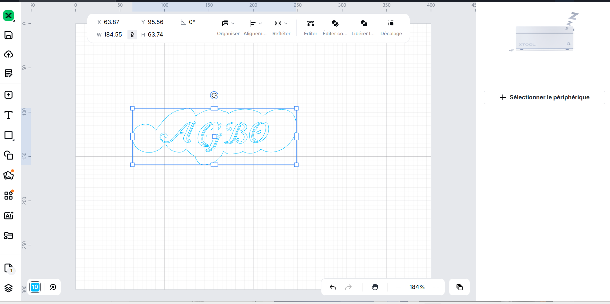
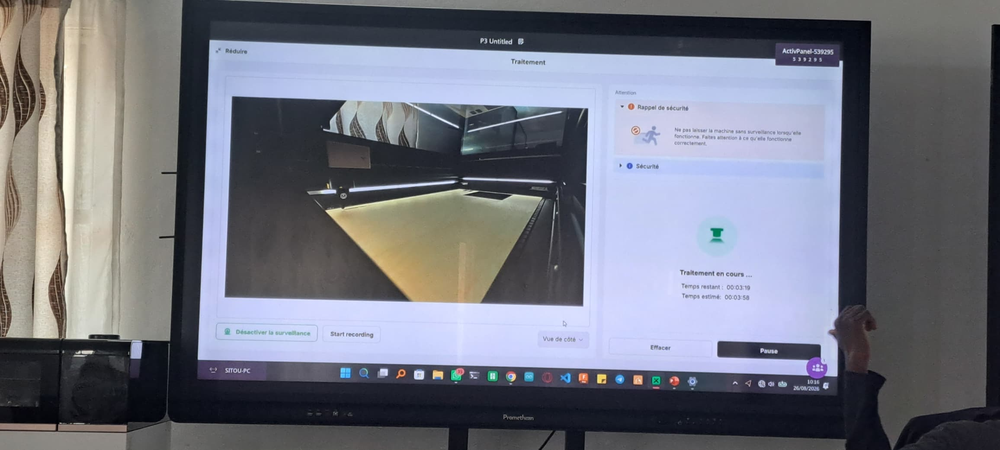
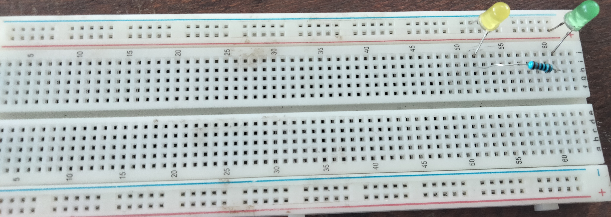
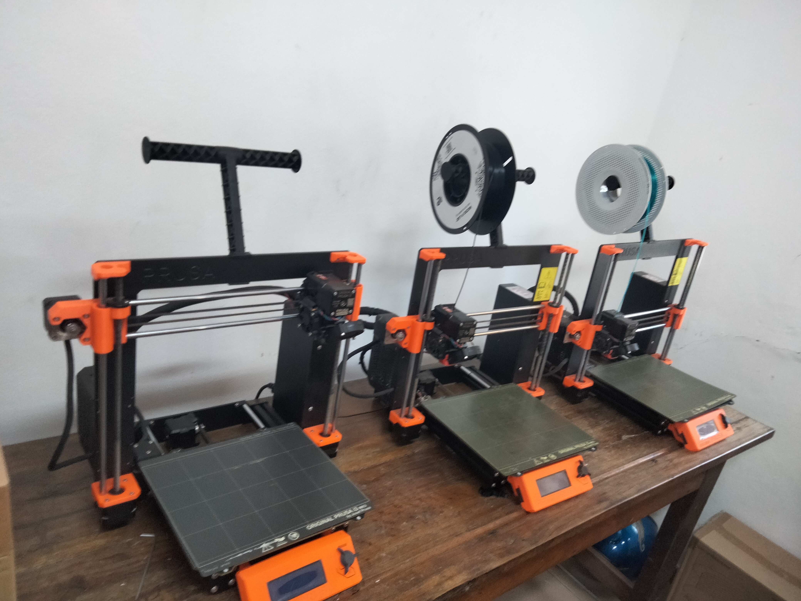
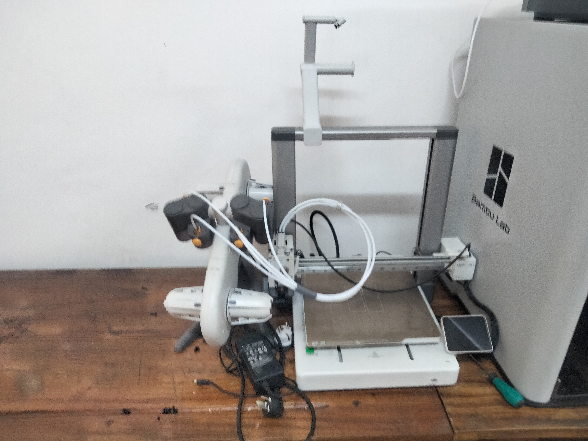
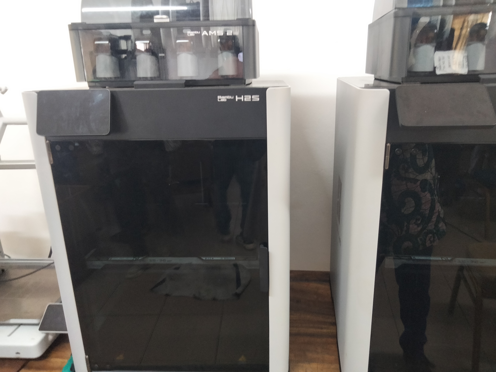

# Journal — mercredi 26 août 2026 (rédigé par : Koffi AGBO)

## Fait aujourd'hui

- on a constistué 4 éauipes de 24 personnes   

 à la suite de ceci, on est passé en atelier.

 ---

>**le premier atelier est consacré à la découverte des découpeuses laser.**  

on a reçu des notions de base sur les découpeuses laser; une prise en main du logiciel xTool Studio qui permet de faire la conception et le paramétrage de la découpeuse laser. 
le premier test a été un sucès.

image de la conception sur xTool Studio  

   

image de la gravure par la découpeuse laser   

  

---

>**le deuxième atelier est consacré à la découverte de l'électronique.**  

cet atelier a été consacré à la notion générale sur certains composants et quelques grandeurs physiques.

Ceci est l'image d'une plaque spk10 sur laquelle sont montés un résistors et deux diodes:
-  

ce qui suit est l'image d'une carte  esp32-C3 et une carte esp32-S3:  
-   

---

>**le troisième  atelier est consacré à la découverte des imprimantes 3D.**   

on a eu une notion sur la fabrication additive; les types d'imprimante 3D; et les types de filaments. Par rapport à la modélisation , on utilisera le logiciel fusion 360. on utlisera le bambou studio pour communiquer avec l'imprimante.
 On distingue les imprimantes à technologie CORE Y; à technologie cartésien 

Ceux-ci sont des images d'imprimante 3D à technologie cartésien :  

   

 

ce qui suit est l'image d'une imprimante à technologie CORE Y

   

---
>**le quatrième atelier est consacré à l& recherche de projet **    

les projets se feront avec les cartes ESP32  

---

## Appris

- de ces ateliers on appris comment réaliser une gravure et découpe à l'aide d'une découpeuse laser; comment mesurer la tension,la résistance; déterminer la valeur d'une résistance à l'aide des codes couleurs.Le seul langage utilisé est le G-CODE. On a abordé également avec des proposition des projets à caractère éducative.
- avant ces séances, on ignoarait les technologies des imprimantes 3D

---

## Raté, puis corrigé

on n'a pas eu de raté car c'est juste des introductions générales au niveau de chaque atelier.

## Décidé

- continuité de la formation en équipe et la présentation des cahiers de charge.

---

  
    

>Signé **Ing. Koffi AGBO **