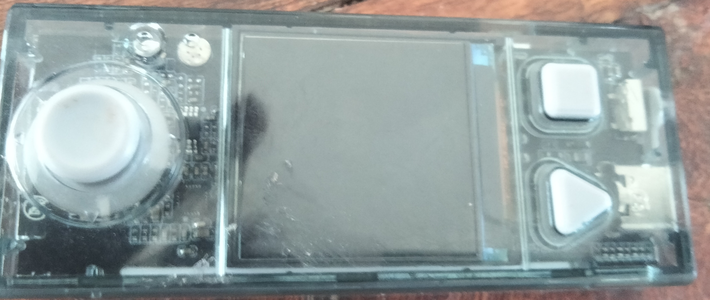
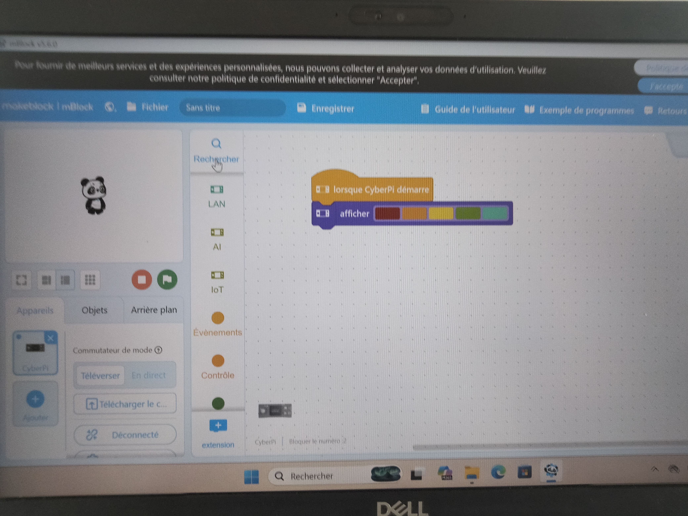
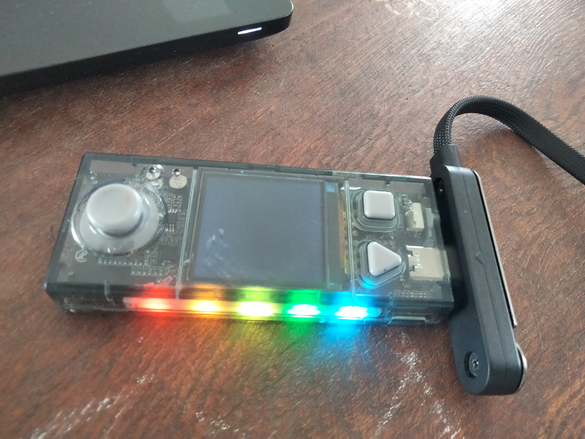
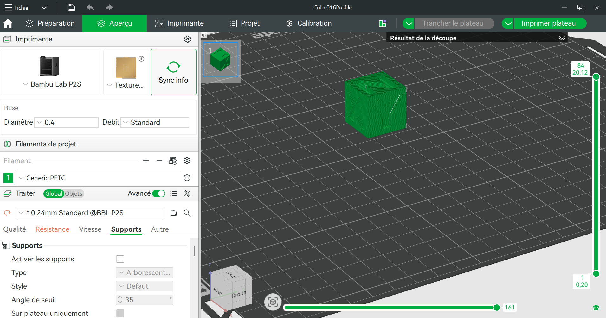
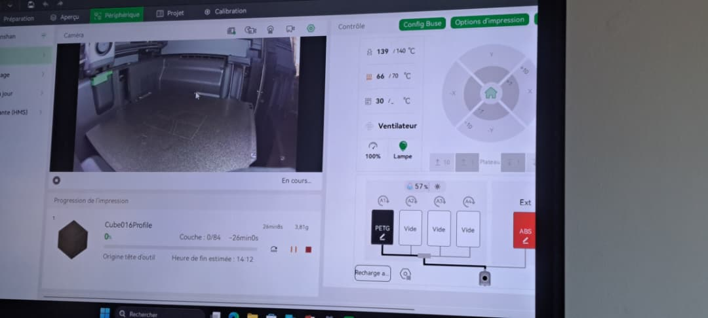
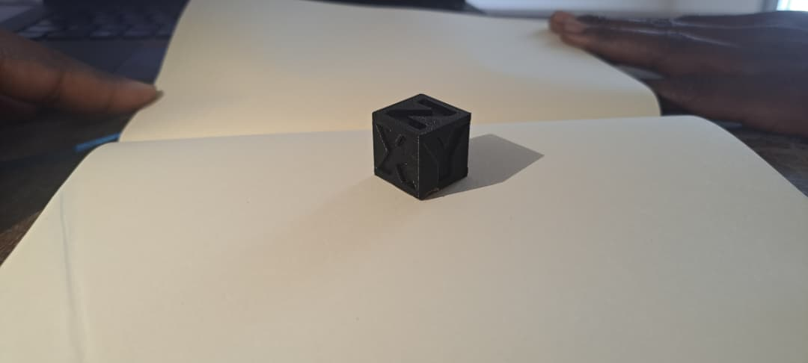
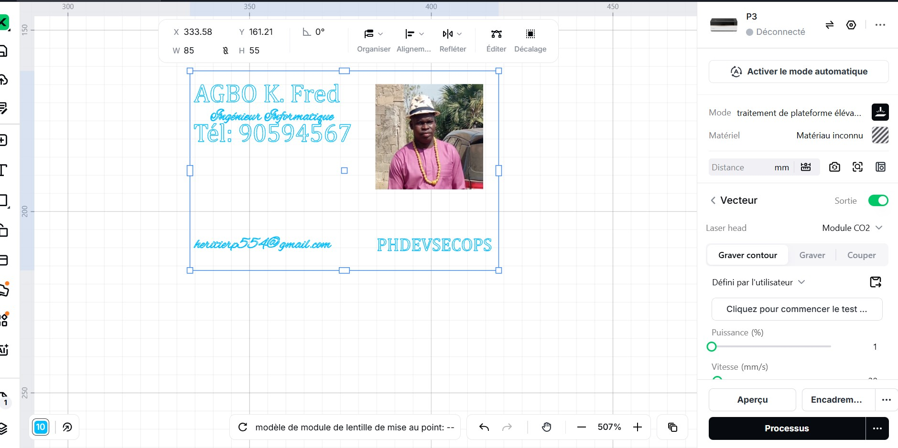

# Journal — jeudi 27 août 2026 (rédigé par : Koffi AGBO)

## Fait aujourd'hui

 La journée s'est démarrée sur le contrôle de présence. A la suite de ceci, chaque équipe est dirigée vers un atelier. C'est ainsi que mon équipe a rejoint celui de l'éléctronique.   

 Le passage de notre équipe dans les quatres ateliers a suivi l'ordre ci-après: électronique - impression 3D - et découpeuse laser 

    
---

---

>**Atelier électronique.**  

on a eu à faire un rappel sur la séance d'hier. 
on a fait une prise en main du logiciel mBlock avec le premier projet: l'allumage automatique. On a utilisé un CyberPi

image d'un cyberPi   

  

image de la conception sur mBlock   

 

image du résultat  

 

---

>** Atelier impression 3D.**  

Après un tour sur les notions de la veille, place à la prise en main du logiciel Bambu studio. celà a conduire au premier test dont voici les images:  

image du paramétrage du cube à imprimer:

image de visualisation de l'impression:   

image du cube imprimé:  

  

---
 
---
>**Atelier découpeuse laser**    

rappels sur la séance précédente;
réalisation du projet: carte de visite personnalisée.ce projet a permis d'appréhender les paramètes du découpeuse laser.
 
 l'image de la conception  

  

---

## Appris

- de ces ateliers on appris comment utiliser le logiciel mBlock pour la réalisation de projet électronique; le logiciel bambu studio pour l'impression 3D.une nouvelle compréhension des découpeuses laser

---

## Raté, puis corrigé

on n'a pas eu de raté car on a eu des assistance au niveau de chaque atelier.

## Décidé

- continuité de la formation en équipe et la présentation des cahiers de charge.

---

  
    

>Signé **Ing. Koffi AGBO **