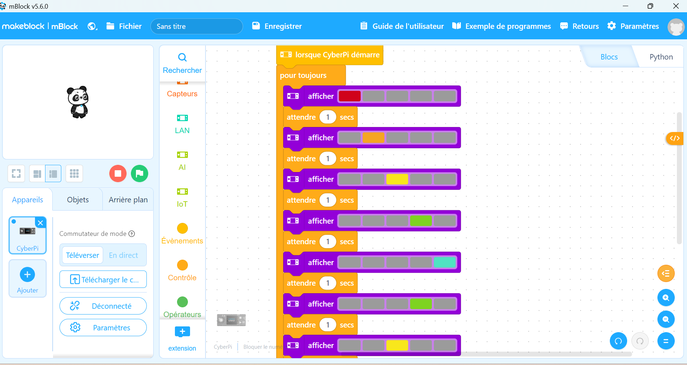
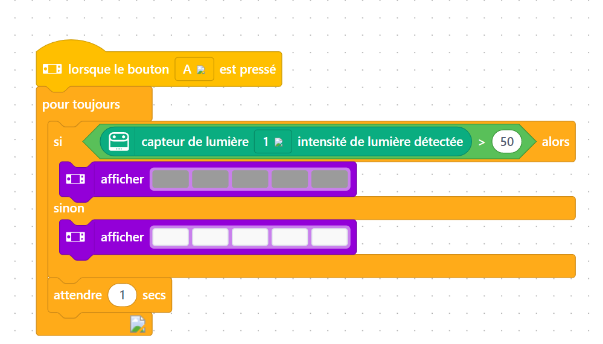
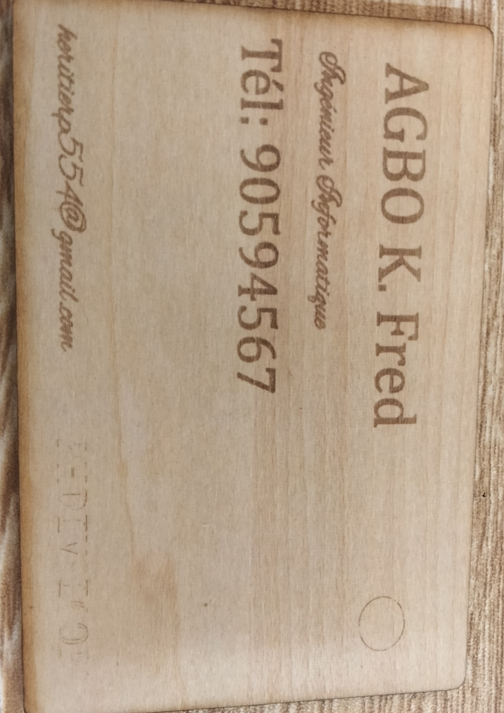
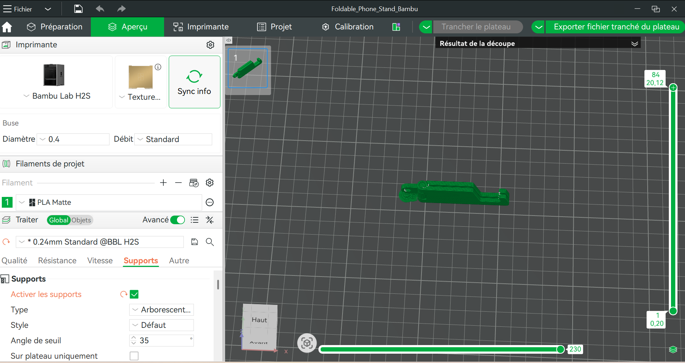

# Journal du vendredi 28 août 2026 (rédigé par : Koffi AGBO)

## Fait aujourd'hui

 Tout comme la veille, la journée s'est démarrée sur le contrôle de présence. A la suite de ceci, chaque équipe est dirigée vers un atelier. C'est ainsi que mon équipe a rejoint celui de l'éléctronique.   

 Le passage de notre équipe dans les quatres ateliers a suivi l'ordre ci-après: électronique -  découpeuse laser - impression 3D et la discussion sur les projets.

---

---

>**Atelier électronique.**  

on a eu à faire un rappel sur la séance d'hier. 
Ala suite du rappel; on est passé aux projets suivants :  
- allumage automatique successive des led avec une pause d'une seconde ,répétition en sens inverse  

- détecteur d'obscurité 

image de la répétition   

  

image de la détection d'oscurité  
 
 

---
>**Atelier découpeuse laser**    

 impression  de la carte du projet: carte de visite personnalisée.on a eu à enlevé la photo.
 
 l'image du resultat  

  

---
---  

>**Atelier impression 3D.**  

Après un tour sur les notions de la veille, on a abordé le projet 2 qui a mis l'accent sur les paramètre de tranchage et l'exportation du fichier tranché sur une clé et imprimé sur une imprimante 3D sans passé par un réseau wifi:  

image du pose portable:

image du pose portable imprimé:  

  

>**Atelier projet.**    

ici, on a aborder les notions sur comment démarrer un projet. C'est dans ce sens qu'on a parlé de disign thinking et de la méthode spirale.

---
---

## Appris

- de ces ateliers on appris comment utiliser le logiciel mBlock pour la réalisation de projet électronique; le logiciel bambu studio pour l'impression 3D. on a également compris à quoi consiste la méthode de design thinking et la méthode spirale. 

---

## À faire demain
- discuter sur le projet de chaque groupe  
- expliquer plus la documentation des projets
---
---  

>Signé **Ing. Koffi AGBO **