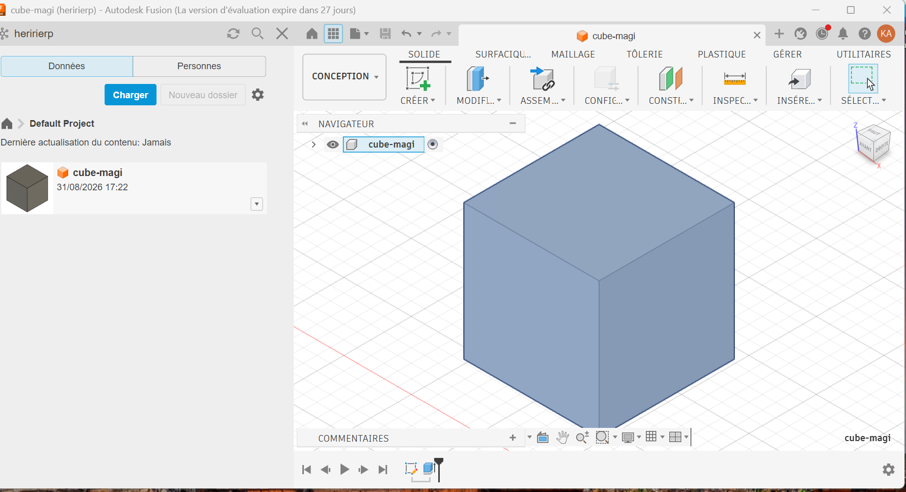

# Journal du lundi 31 août 2026 (rédigé par : Koffi AGBO)

 

## Fait aujourd'hui

 La matinée a été consacrée à la finalisation des projets et la présentation des besoins.
 
 En soirée , on a eu à faire une prise en main du logiciel fusion 360 qui s'est terminée sur la conception d'un cube.
 

---
---

## Appris

On a appris les fonctions de base sur le logiciel fusion.   

image de la conception du cube  
 

---  

---

>Signé **Ing. Koffi AGBO**