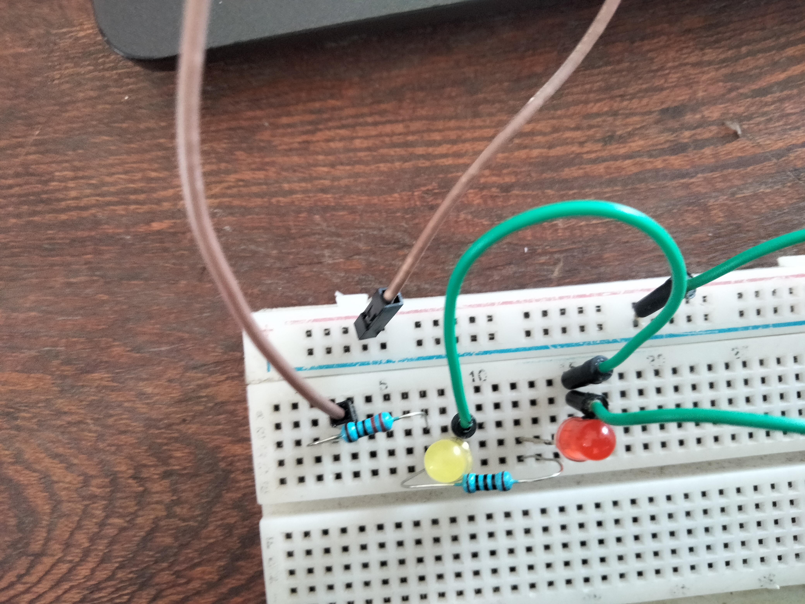
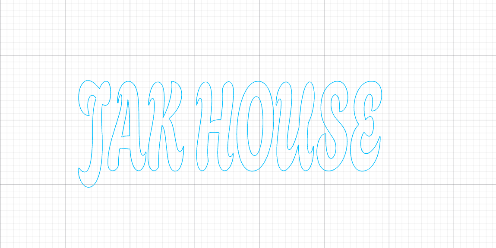
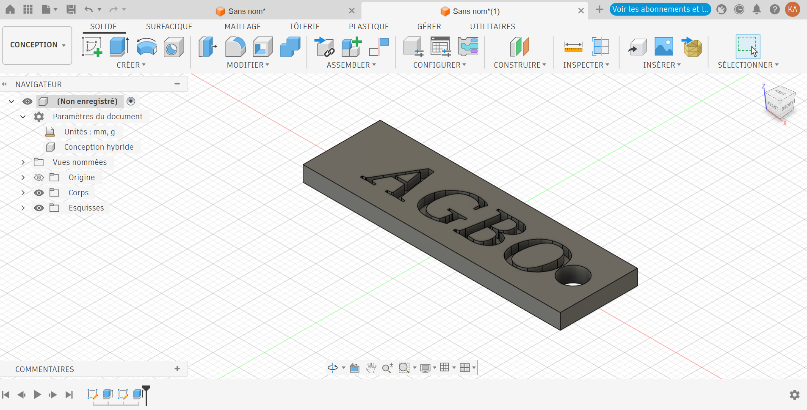

# Journal du 1er septembre 2026 (rédigé par : Koffi AGBO)

 

## Fait aujourd'hui

 on a eu à faire le tour de trois ateliers à savoir : électronique, impression dtf et conception sur fusion.  

 En atelier d'électronique, on a réalisé le cablage de que circuit. ceci a permis de maîtriser le breadbord et réaliser le cablage de quelques circuit sur une plaquette d'essai.

- image d'un circuit réalisé sur le sk10:

 

Au niveau de l'atelier impression dtf; on a eu à faire une conception sur xtool studio et l'imprimé sur l'imprimante dtf

- image de la conception:  

   

Au niveau de l'atelier de conception avec  fusion 360 , on a fait un rappel sur ce qui a été fait à la veille et on en enchaîné avec différentes conception avec diverses techniques. L'image suivant est l'une des conceptions faites.  

c'est sur l'eportation de cette conception que s'est terminée la journée
---
---

## Appris

On a appris comment manipuler une plaquette d'essai , une imprimante dtf et une prise en main avancé du logiciel fusion 360
---  
---

>Signé **Ing. Koffi AGBO**