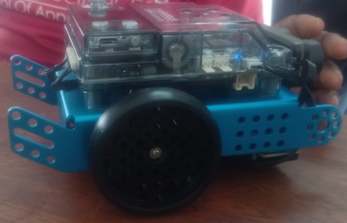
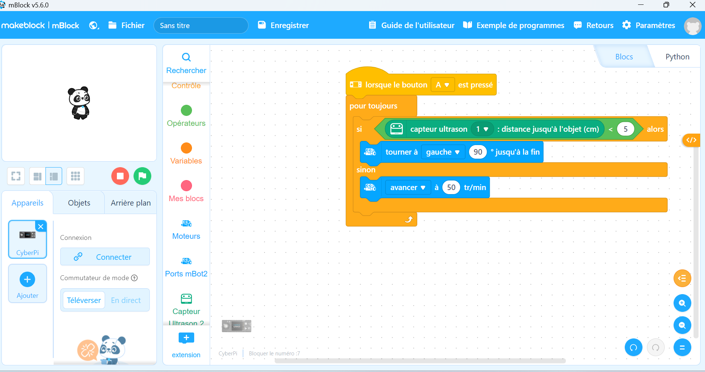
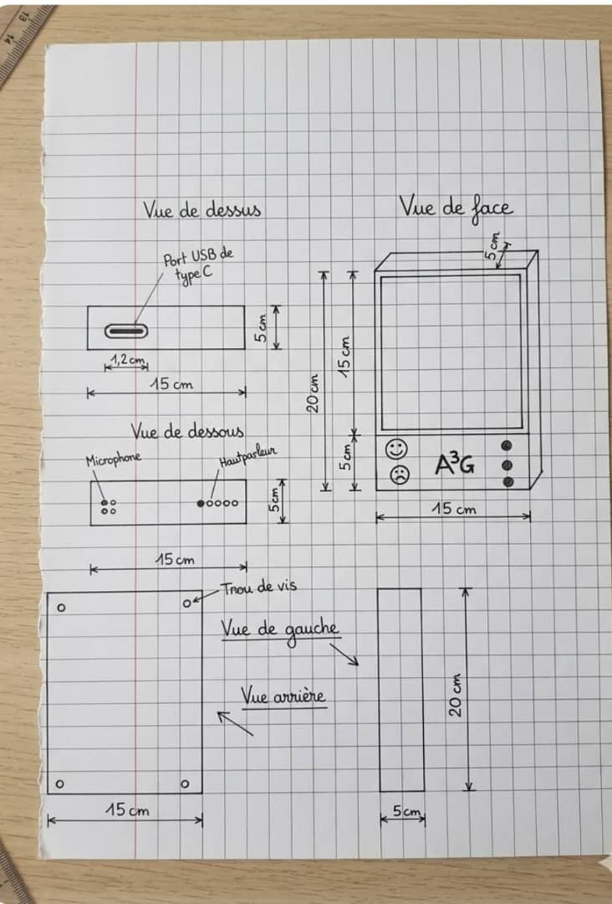

# Journal du 2 septembre 2026 (rédigé par : Koffi AGBO)

 

## Fait aujourd'hui

 on a eu à faire le tour de trois ateliers à savoir : électronique, algorithmique et projet.  

 En atelier d'électronique, on a assemblé un robot voiture et ensuite écrire un code dans mblock pour le faire avancer et changer de direction en 5cm d'un obstacle. .

- image de la voiture:

  

- image de la conception:
  

Au niveau de l'algorithmique; on a eu les notions de base d'algorithme en général et sur l'algorithme débranché en particulier.

Au niveau du projet, on a eu à discuter en équipe et faire des esquisses du prototype final. cet exercice a permis de dégager de manière plus claire les besoins en terme de composant à utiliser pour réaliser le projet.  
- image de la conception:
 

---
---

## Appris

On a appris comment comment assembler des composants électroniques et une base générale de l'algorithmique.
---  
---

>Signé **Ing. Koffi AGBO**