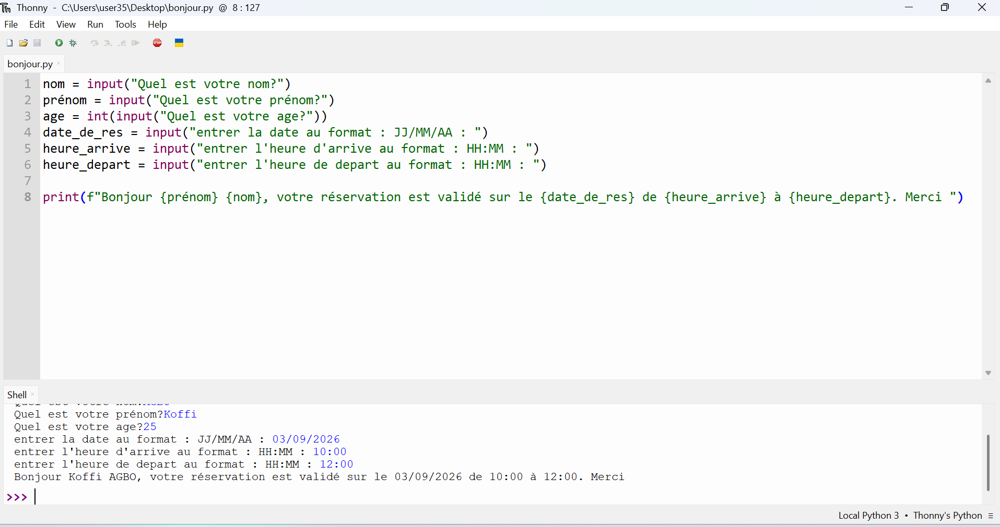

# Journal du 3 septembre 2026 (rédigé par : Koffi AGBO)

 

## Fait aujourd'hui

 on a eu à faire le tour de deux ateliers à savoir : programation python et projet.  

 En programmation python, on a abordé la notion générale sur les langages de programmation.Ceci a permit de faire une prise en main de l'IDE Thonny qui est une IDE de python.
Cela a permit de faire les premiers pas avec python.

la photo ci-dessous est une illustration de l'une des codes écrits en python :

En atelier projet, on a eu à discuter autour du projet robot compagnon de lecture. on a abordé les différentes fonctionnalitées du robot et le circuit électronique.

 

---
---

## Appris

On a appris les bases de python ainsi que certaines règles syntaxiques de python.
---  
---

>Signé **Ing. Koffi AGBO**