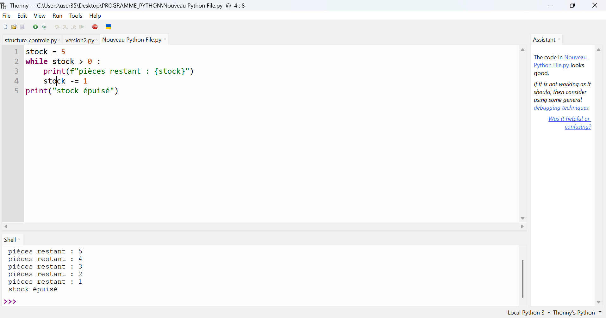
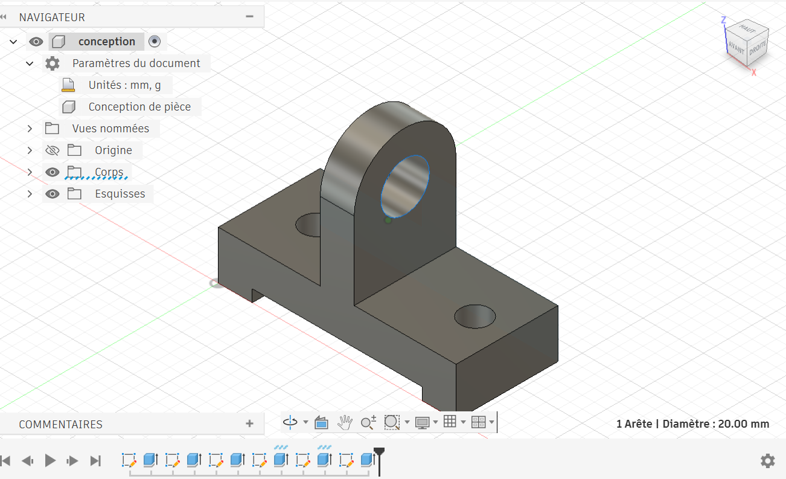

# Journal du 4 septembre 2026 (rédigé par : Koffi AGBO)

 

## Fait aujourd'hui

 on a eu à faire le tour de trois ateliers à savoir : programation python et fabrication PCB et impression 3D.  

 En programmation python, on a abordé les structures de contrôle, les boucles for et while, les opérateurs, les listes ; tuples , dictionnaire et fonctions.

la photo ci-dessous est une illustration de l'une des codes de boucle en python :

En atelier fabrication PCB, on a eu à  voir comment importer un circuit dans xtool et imprimer avec F2 ultra .

 
En atelier impression 3D, on a fait une modélisation d'un support .
image du support modélisé:

---
---

## Appris

On a appris de nouvelles syntaxe de python ainsi que certaines règles syntaxiques de python.
---  
---

>Signé **Ing. Koffi AGBO**