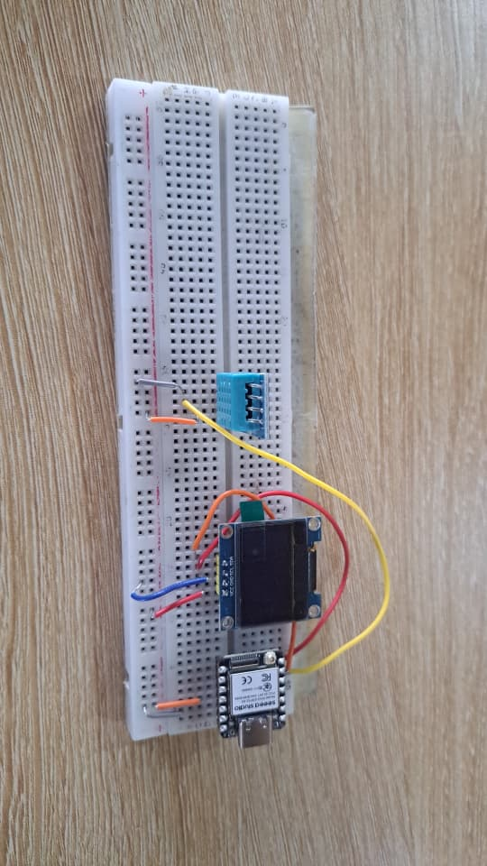
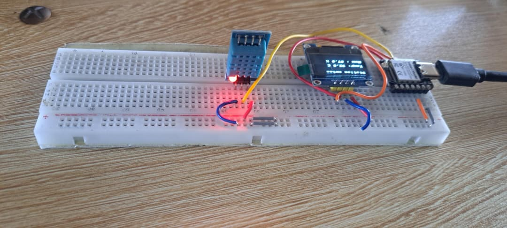

# Journal du 4 septembre 2026 (rédigé par : Koffi AGBO)

 

## Fait aujourd'hui

 on a eu à faire de programation python.  

on a eu à faire du micropython.ce qui a permit de réaliser une mini station météo.

on a réalisé une mini station  météo
l'image qui suit est une illustration du cablage de la réalisation.

l'image suivant est une illustration de la mini station réalisée

---
---

## Appris

On a appris de nouvelles syntaxe de python ainsi que certaines règles syntaxiques de python.
---  
---

>Signé **Ing. Koffi AGBO**