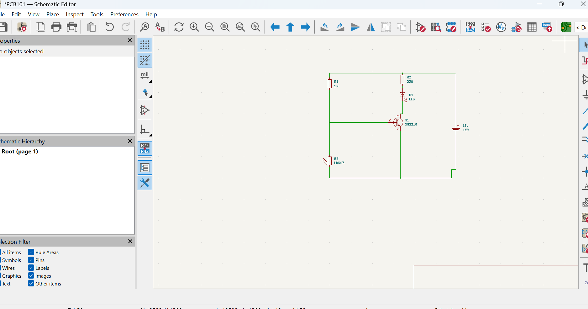
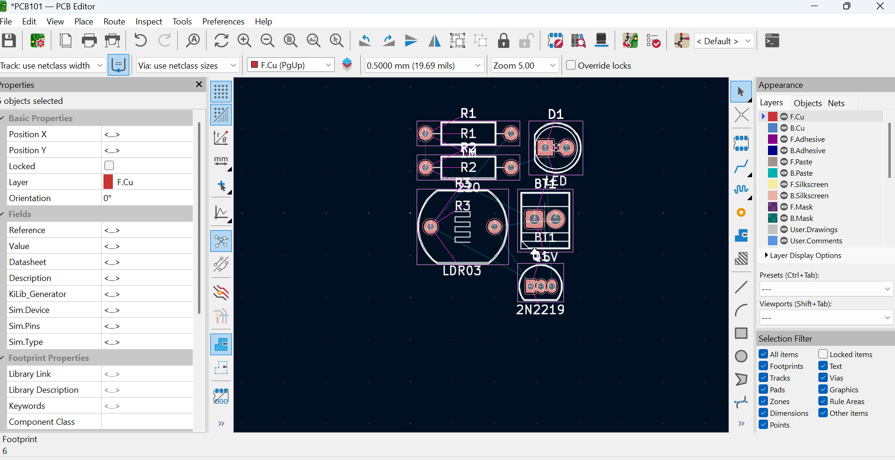
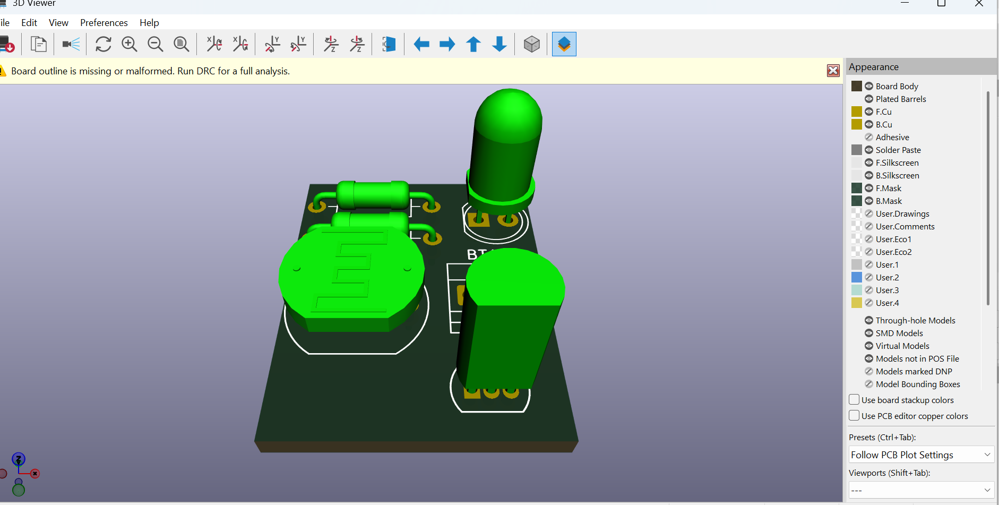
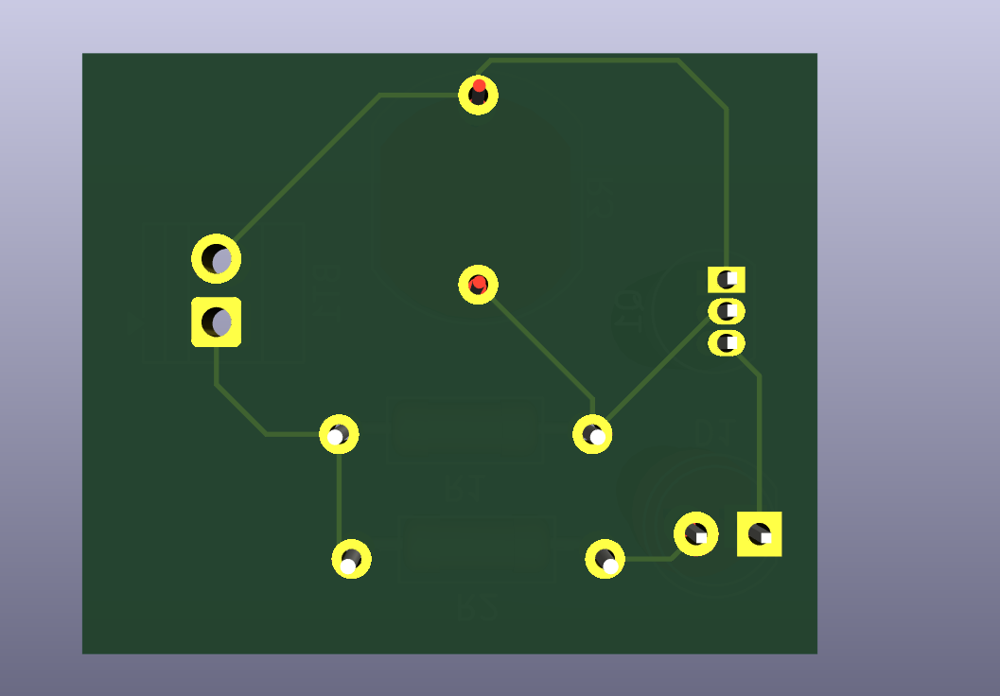

# Journal du 7 septembre 2026 (rédigé par : Koffi AGBO)

 

## Fait aujourd'hui

 on a eu à faire de l'éléctronique.prise en main kicard pour la conception des circuits afin de réaliser un pcb.  

image du circuit
  

image du Debut de la conception pcb
  

image du 3D du pcb
 

image du routage du pcb

---
---

## Appris

On a appris comment partir du circuit et obtenir le circuit imprimé.
---  
---

>Signé **Ing. Koffi AGBO**