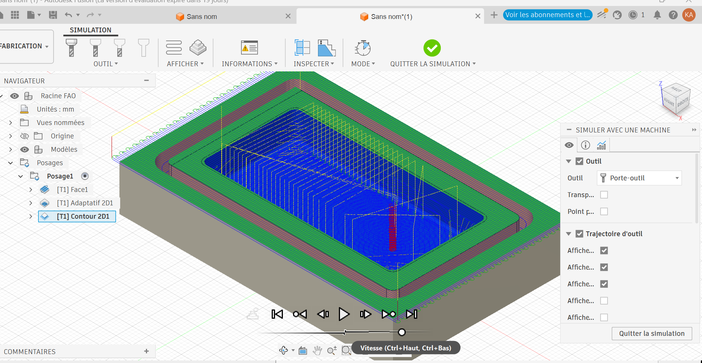
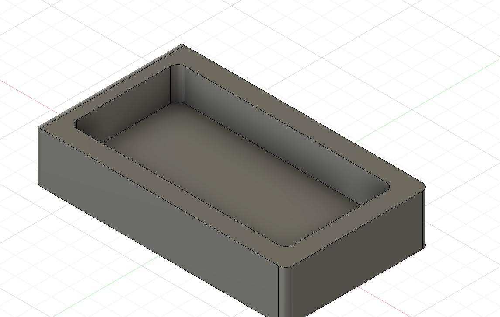
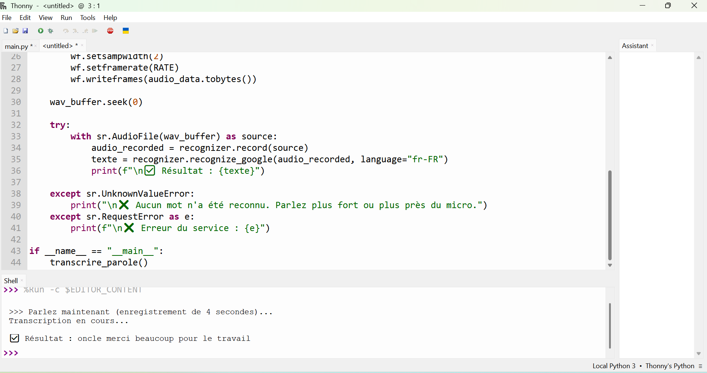
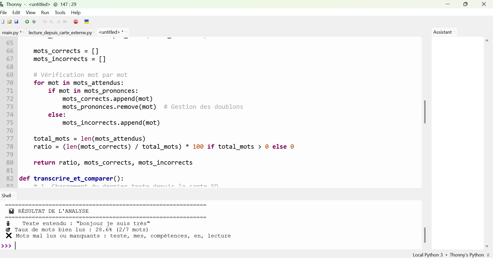

# Journal du 8 septembre 2026 (rédigé par : Koffi AGBO)

 

## Fait aujourd'hui

 on a eu à faire de la fabrication assistée par ordinateur. cela a permis de voir les paramétrages nécessaires pour une FAO. 

image du 
  

image du Debut 
  

on a travaillé sur le projet robot compagnon de lecture. on a fait une discussion sur le circuit
  

image du Debut 

---
---

## Appris

On a appris comment partir de la conception CAO et arriver à un FAO.on a vu l'état d'avancement du projet
---  
---

>Signé **Ing. Koffi AGBO**