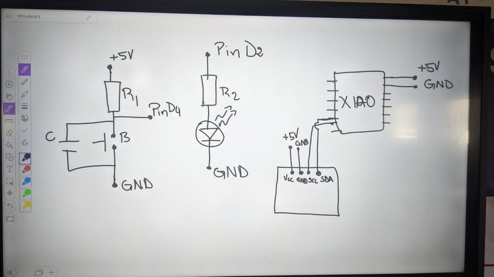
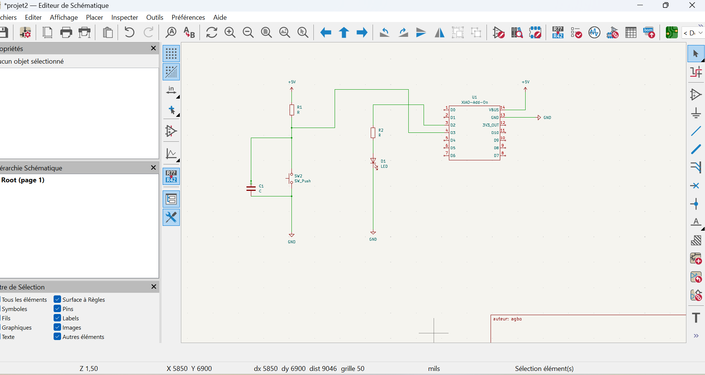
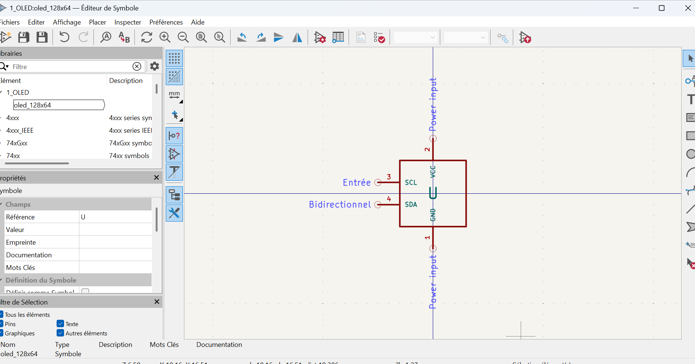

# Journal du mercredi 9 septembre 2026 (rédigé par : Koffi AGBO)

 

## Fait aujourd'hui

 On a pris un projet allumage led. on a réalisé le circuit sur kicad.

l'image qui suit illustre les composants qu'on doit rassembler pour réaliser le circuit.  
  

l'image suivante est le début du circuit 
  

ici on a créé manuellement la bibliothèque
  

on a exporter le circuit pour debuter un pcb.
à la suite de cela ,on a fait un tour sur la programmation en micropython avec thonny.
---
---

## Appris

On a appris comment partir de l'idée d'un projet et réaliser le circuit correspondant.
---  
---

>Signé **Ing. Koffi AGBO**