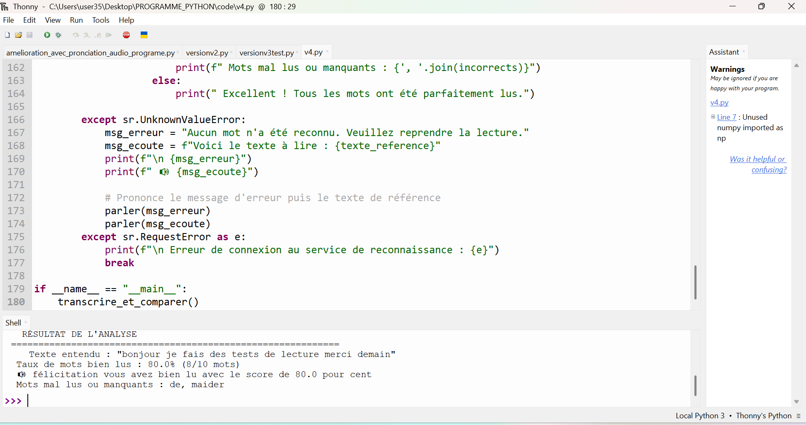
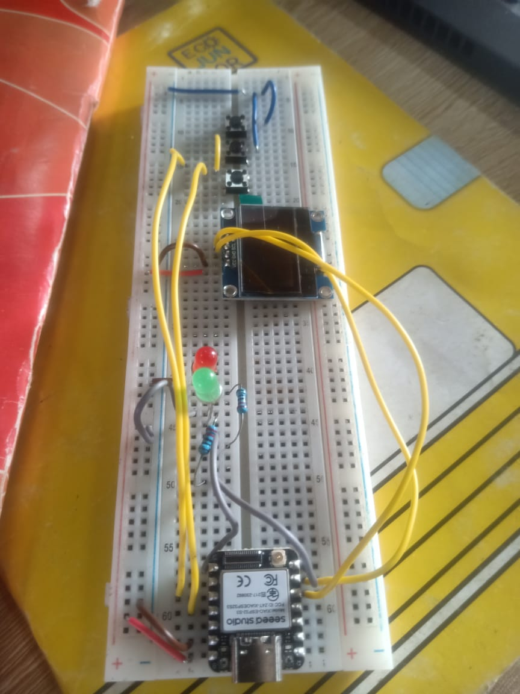
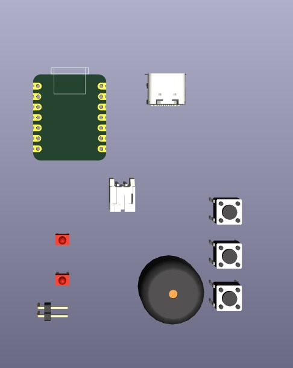

# Journal du jeudi 10 septembre 2026 (rédigé par : Koffi AGBO)

 

## Fait aujourd'hui

 on a travaillé en équipe sur le projet Robot compagnon de lecture. 
Oan a ajouté quelques amélioration au code précédent; puis passer l'amélioration de la modélisation du boîtier et de la pcb.

l'image suivant est une illustration du code en micropython
  

l'image ci-dessous est une illustration du circuit réalisé sur la plaquette d'essai
  

l'image ci-dessous est une illustration du début de la conception du pcb dans kicad
  

---
---

## Appris

On a appris à travaillé en équipe, comment faire une synthèse après une discussion en équipe.
---  
---

>Signé **Ing. Koffi AGBO**