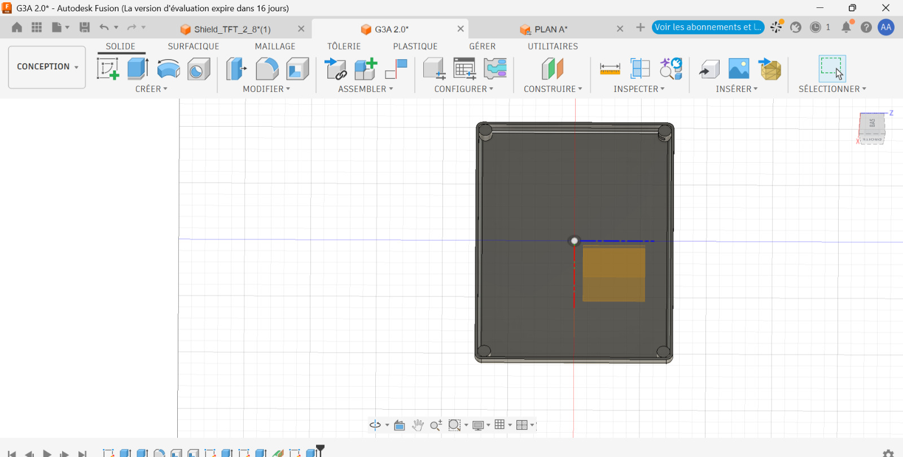
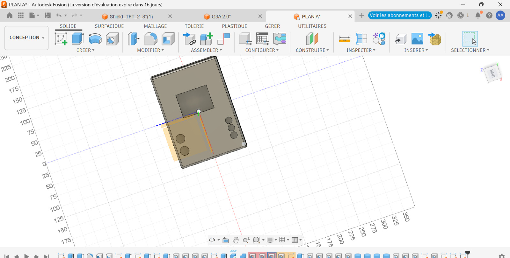
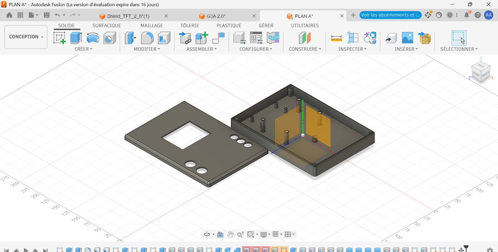
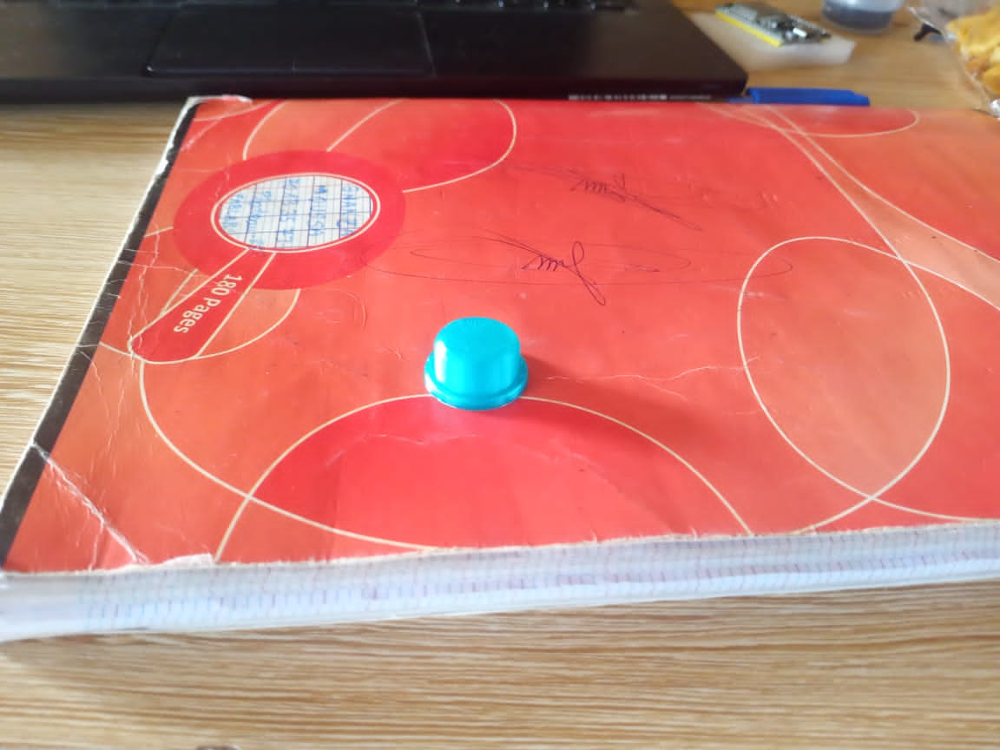

# Journal du jeudi 10 septembre 2026 (rédigé par : Koffi AGBO)

 

## Fait aujourd'hui

on a travaillé en équipe sur le projet Robot compagnon de lecture. 
on s'est consacré sur le boîtier et les couvres bouton.

les images ci-dessous illustre les différentes réalisations
  

  

  

---
---

## Appris

On a appris à améliorer les codes et conceptions.
---  
---

>Signé **Ing. Koffi AGBO**