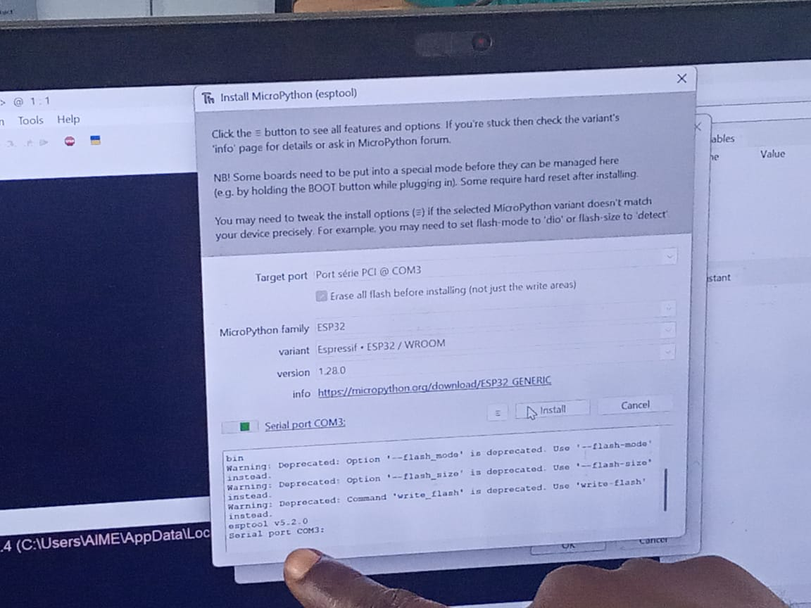
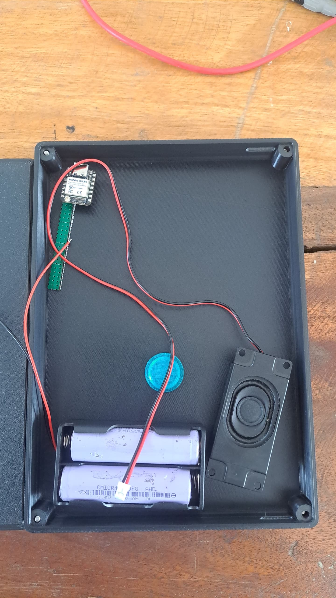
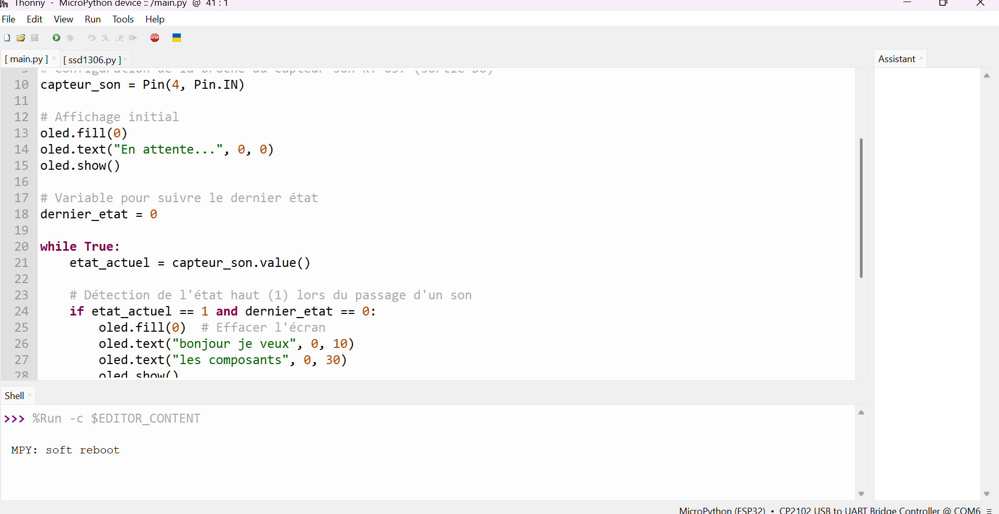
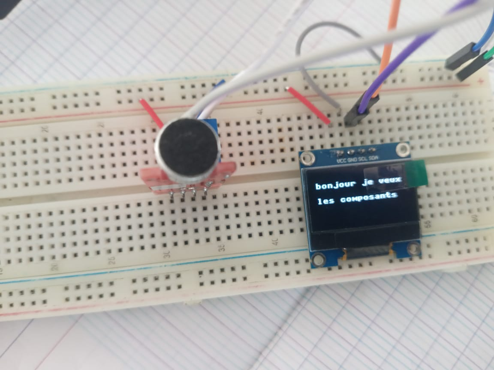

# Journal du samedidi 12 septembre 2026 (rédigé par : Koffi AGBO)

 

## Fait aujourd'hui

on a travaillé en équipe sur le projet Robot compagnon de lecture. 
on s'est consacré sur l'impression 3D du  boîtier et le test du code avec le circuit réalisé sur la plaquette d'essai.

les images ci-dessous illustre les différentes réalisations

cette image est l'illustration des couvres du boitier
  

celle-ci est le flash du esp32 vue que c'est la première utilisation
  

image de l'essai de positionnement des composants
  

celle-ci est l'image du boîtier complet

cette image est l'illustration du programme à exécuter par le sep32
  

cette dernière illustre le fonctionnement du programme avec le circuit réalisé sur la plaquette d'essai

---
---

## Appris

On a appris à améliorer le code et revoir les erreurs liées à la conception.
---  
---

>Signé **Ing. Koffi AGBO**